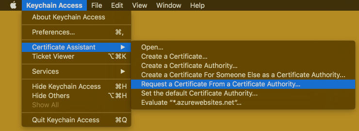
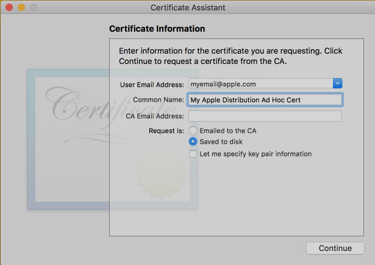
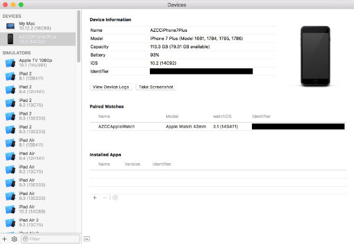
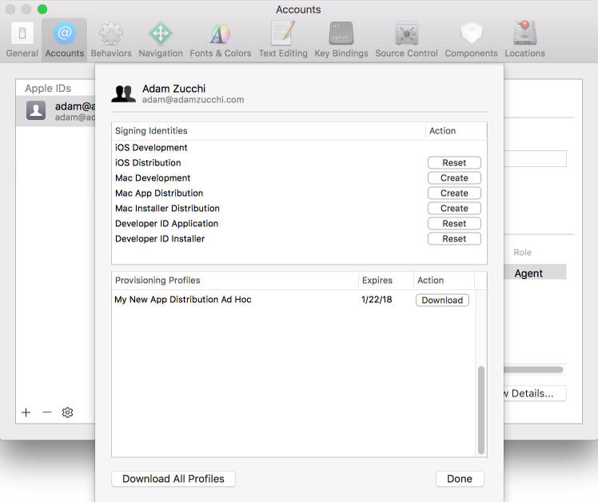
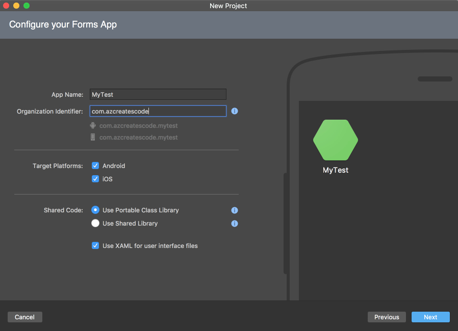
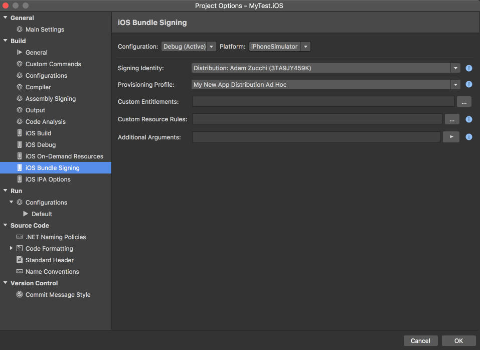

Let's get this out of the way and point out the elephant in the room.  Apple's app provisioning process.  It is required for every new iOS project whether working on a native iOS app in Objective-C or Swift using Xcode, or in our case a Xamarin.iOS application.  

Over the years this is one area I believe I have truly mastered, and I know it is a headache for many so why not create a simple post to go over the necessary steps.  And with all the new Microsoft developers jumping into Xamarin development, you are bound to run into this sooner or later.

### Creating the Certificate
1. Before you even create a new Xamarin.iOS project, go to the [Apple Developer Portal](https://developer.apple.com).  __I have found that this is best done using Safari on your Mac.__
2. Choose the "Account" tab at the top right.
3. Login with your Apple developer credentials.
4. Once you are logged into the portal, if you are a part of more than one Apple developer team, ensure you are logged into the correct one by choosing from the dropdown at the top right of the screen.
5. Next choose "Certificates, Identifiers & Profiles."
6. Choose "All" under the "Certificates" pane on the left side of the screen.  All of your Apple certificates will be displayed to the right.  If you already have a certificate that you created previously and would like to use skip down to XXX step, otherwise continue to 7.
7. To create a new certificate, click the '+' icon at the top right.
8. You will then be asked to choose the type of certificate you'd like to create.  
9. I like to choose "App Store and Ad Hoc" under "Production."  Choose "Continue."
10. Next you are asked to create a Certificate Signing Request or CSR.
11. Open the "Keychain Access" app on your Mac.
12. Once the app is open, choose "Keychain Access" from the file menu (next to the Apple Icon), scroll down to "Certificate Assistant" and then select "Request a Certificate From a Certificate Authority..." as show below:
	1. 
	2. 
13. You will be presented with a "Certificate Assistant" window that looks like the following image.  Enter your Apple developer email, a common name for the certificate (can be anything), and choose the "Saved to disk" option.
	1. 
	2. 
14. Hit "Continue" on the Certificate Assistant window.
15. Choose to save the .certSigningRequest file to your Desktop.
16. Go back to Safari, choose "Continue" from the About Creating a Certificate Signing Request (CSR) page.
17. On the "Generate your certificate" page select "Choose File..." and select the .certSigningRequest file you saved to your desktop on step 15 above and then hit "Continue."
18. You should now be on a page that says "Your certificate is ready" with the option to download the certificate.  Select the "Download" button.
19. Navigate to your Downloads folder and find the file named "ios_distribution.cer" and double click it.  An "Add Certificates" window displays with the login keychain selected in the dropdown.  Leave this as it is and choose "Add."
20. Navigate back to the "Keychain Access" application and make sure "Certificates" is the selected category in the left pane.  Once Certificates is selected in the pane on the left, search the right pane for "iPhone Distribution: YOUR_DEVELOPER_NAME."  That row should have an expiration date one year from today's date and if you expand the row via the small arrow/chevron to the left of the certificate name you should see the common name you entered on step 13 above.  

Congratulations, you now have a working certificate that you will be able to sign apps with!  **It is super important to export this certificate and have a backup in a safe encrypted place.  Because you did the CSR with your computer currently your machine is the only computer that would be able to sign apps with your account.  If you are working on a project with a team of developers you will want to export the certificate for them so they can install it into their Keychain Access app.**

### Creating an Apple App ID
1. If you are not logged into the Apple Developer Portal follow steps 1-5 from **Creating the Certificate** above.
2. Choose "App IDs" under the "Identifiers" pane on the left side of the screen.  All of your existing app identifiers will be displayed to the right.
3. To create a new identifier, click the '+' icon at the top right.
4. On the "Registering an App ID" page fill out the following:
	1. App ID Description Name - Enter the name of your application here (this will be the common name of your identifier that shows up in the list on step 2 above.
	2. App ID Prefix - Leave this as the default selected
	3. App ID Suffix - Choose Explicit App ID and enter the Bundle ID field.  **Apple recommends using a reverse-domain name style string (i.e., com.domainname.appname.  Asterisks are not allowed for an explicit App ID.**  Some developers like to create Wildcard App IDs which allow App IDs to be reused with many apps, however anytime I have seen this approach used the App IDs are poorly managed and being able to tell which App IDs are used with what provisioning profile becomes a nightmare (we'll get to provisioning profiles in a bit).
	4. App Services - Leave this as the default selected
5. Choose "Continue."  You are then taken to a "Confirm your App ID" page where you can review your settings.  Select "Register."

Perfect, you now have both a working certificate and have your Apple App ID setup for your app!

### Adding iOS Devices
Any iOS device you plan to use during development and deploy builds to for testing will need to be registered on the Apple Developer Portal.  This is a very simple (yet tedious) process.
1. Plugin your iOS device into your Mac.
2. You may receive a notification on your phone asking if you want to "Trust This Computer?"  If you want to be able to debug and test on this device you must choose "Trust" on your iOS device.
3. Next, I'm going to assume you have Xcode installed because you plan to do iOS development, go ahead and open it.
4. Choose "Window" from the menu bar and select "Devices."
5. Select your connected iOS device from the pane on the left and the details on the right will update as shown below:
	1. 
	2. 
6. The redacted area in black (the top one) is my iPhone's device UDID (ignore the redacted box on bottom, that is my Apple Watch), copy your UDID to your clipboard.
7. Again if you are not logged into the Apple Developer Portal follow steps 1-5 from **Creating the Certificate** above.
8. Choose "All" under the "Devices" pane on the left side of the screen.  All your registered devices will be displayed to the right.
9. To add a new device, click the '+' icon at the top right.
10. Enter a friendly or common name in the "Name" field and paste the identifier you copied from Xcode in the UDID field.
11. Choose "Continue."
12. You will be directed to a "Review and register" screen, choose "Register" on the bottom.  **Keep in mind you can only register 100 devices of each type to the Apple Developer Portal (100 iPhones, 100 iPads, etc.).  This list is also only editable annually, meaning after adding a device the device cannot be officially removed until your Apple Developer Program annual renewal.**
13. Repeat this process for any other devices you wish to deploy to during application development.

You now have a physical iOS device registered in the portal that you will be able to deploy builds to!

### Creating a Provisioning Profile
1. Again if you are not logged into the Apple Developer Portal follow steps 1-5 from **Creating the Certificate** above.
2. Choose "All" under the "Provisioning Profiles" pane on the left side of the screen.  All your created provisioning profiles will be displayed to the right.
3. To add a new provisioning profile, click the '+' icon at the top right.
4. You will be directed to a page asking "What type of provisioning profile do you need?"  We chose "Production - App Store and Ad Hoc" for our certificate so you'll want to stay the production/distribution course here and choose "Ad Hoc" under "Distribution." Choose "Continue."
5. Next you'll be directed to a page asking you to "Select App ID."  You will want to choose the App ID you previously entered from our "Creating an Apple App ID" section above in step 4.3.  Choose "Continue."
6. Next you'll be directed to a page asking you to "Select certificates."  You might be seeing a pattern here, but we are finally connecting all the dots from the previous steps.  Go ahead and choose the certificate we created above in the "Creating the Certificate" section.  **As a general rule of thumb, you will always want to select the newest certificate (the one with the latest expiration date) available in this step if more than one is presented.  It is also possible that if another team member had went through the CSR process above and created a certificate from their own machine it will be an option for you in this list but you need to make sure they export it from their Keychain Access so you can install it and sign apps with it.**
7. Choose "Continue."
8. Now you'll be directed to a page asking you to "Select devices."  Select the device you added above in the "Adding iOS Devices" portion of this post.  Also select any other devices you wish to be able to build to during development.  Choose "Continue."
9. Lastly you will be directed to a page asking you to "Name this profile and generate."  Enter a name in the "Profile Name" field.  Since I like to create an App ID and provisioning profile for each app I work on (and not share them), I like to be more specific with a name such as "My New App Distribution Ad Hoc."  Choose "Continue."
10. You will be directed to a "Your provisioning profile is ready" page.  You have the option to download the profile here but I like to do that in Xcode which we'll do next.

Congratulations - If you're still with me you're now **DONE** with Apple app provisioning, at least on the Apple Developer Portal site!

### Getting the Provisioning Profile from Xcode
1. I like to have Xamarin Studio closed while I do this step (I have seen issues come up when it's left open), so go ahead and quit Xamarin Studio.
2. Open Xcode and navigate to Preferences, which can be done by navigating to the menu bar, choose "Xcode" and selecting "Preferences."
3. Once the Preferences window opens, navigate to the "Accounts" tab. If your Apple ID is not listed here, choose the '+' icon located at the bottom left and enter your Apple Developer credentials.  Once you're authenticated (or if you already were) choose your Apple ID from the pane on the left and your Apple ID details will be displayed to the right.
4. Choose your developer team under "Team" which is most likely your name.  Then choose "View Details."
5. On the details view you'll notice "Provisioning Profiles" on the bottom.  Depending on whether or not you have multiple profiles you may need to scroll this list but you should be able to find the profile you created above in the "Creating a Provisioning Profile" section.  Choose "Download" for your profile.
	1. 
	2. 

That's it! You've setup and downloaded your certificate, setup an App ID, registered an iOS device, created and now downloaded your provisioning profile.  We can finally open Xamarin Studio!!!

### Setting Up Xamarin.iOS Project
1. From Xamarin Studio choose File - New Solution.
2. I've been working on a lot of Xamarin.Forms projects recently so let's choose "App" under "Multiplatform" and then "Forms App" to the right.  **This could also just as easily be done outside of a Forms app by choosing an iOS template.**  Choose "Next."
3. Give your app a name in the "App Name" field.  This should be the final suffix after the last "." in your App ID.  For example my App ID is: "com.azcreatescode.mytest".  My App Name field is "MyTest".  Then enter your "Organization Identifier" which is again the App ID you setup earlier **MINUS** the final suffix you entered for the app name.  My organization identifier would be: "com.azcreatescode".  The goal here is to get your entire App ID to display properly under the Organization Identifier field.  **If this is confusing and or you hoped to give your app a different name than the final suffix of your App ID that is fine, we can change this App ID in a few steps.**  Choose "Next."
	1. 
	2. 
4. Choose your project and solution names.  Choose "Create."
5. You are now going to see Xamarin Studio finalize the creation of your project, download some packages, etc.  Under your solution you should see a .iOS project.
6. If you were unable to get your organization identifier setup properly on step 3 above or if you'd like to just verify the App ID, expand the iOS project and double-click the "info.plist" file.  You will see the "Application Name" field which is editable (this is the text that will display below the app icon when installed on the device and or simulator).  Below Application Name is Bundle Identifier, ensure this is the App ID you setup earlier in Apple Developer Portal, if it doesn't match change it here.  This is a crucial step to ensuring we are able to select the provisioning profile in a few steps.  Save the info.plist file and close it.
7. Next double click the iOS project (or right click it and choose "Options").  The iOS project's settings/options will display in a new window.
8. Choose "iOS Bundle Signing" under "Build" in the left pane.
9. Configuration by default is set to "Debug (Active)" and Platform is set to "iPhoneSimulator.  For starters leave those values. and 
10. Select the "Signing Identity" dropdown and choose "Distribution: YOUR_NAME."  There may be a strange sequence of letters and numbers behind your name in parentheses, this is completely normal.  It's a unique string Apple assigns your developer team.  It is also possible that you may have multiple Distribution: YOUR_NAME instances listed if you have more than one distribution certificate on your machine.  Unfortunately you'll have to attempt one and if it doesn't give you the provision profile(s) you'd expect you'll have to try the other.  This is just how Xamarin Studio lists your certificates based on how Apple names them.  If you instead created a developer certificate above look for "Developer: YOUR_NAME."
11. Next select the "Provisioning Profile" dropdown and choose your provision profile that we created above.  If it is not listed, go back to step 6 above in this section and verify your App ID / Bundle Identifier was properly set.
12. Now toggle the Platform dropdown to "iPhone."  Next we'll set the certificate and provisioning profile that should be used when building to a physical iOS device in debug mode.  Once again repeat steps 10 and 11 from this section.
13. Now toggle the Configuration dropdown to "Release".  Now we'll set the certificate and provisioning profile that should be used when building in release mode.  Repeat steps 10 and 11 from this section for both the iPhoneSimulator and iPhone platforms.
14. At this point both debug and release, for both the simulator and iPhone should be set to use our certificate and profile, that is four different configurations in total.
	1. 
	2. 

I realize this was an extremely long post, but I think we covered the Apple provisioning process about as thoroughly as possible.  There may be a few "gotchas" along the way that I breezed over so feel free to get in touch.  I'd be happy to help out and get you on track to build great Xamarin.iOS projects!  Good luck!